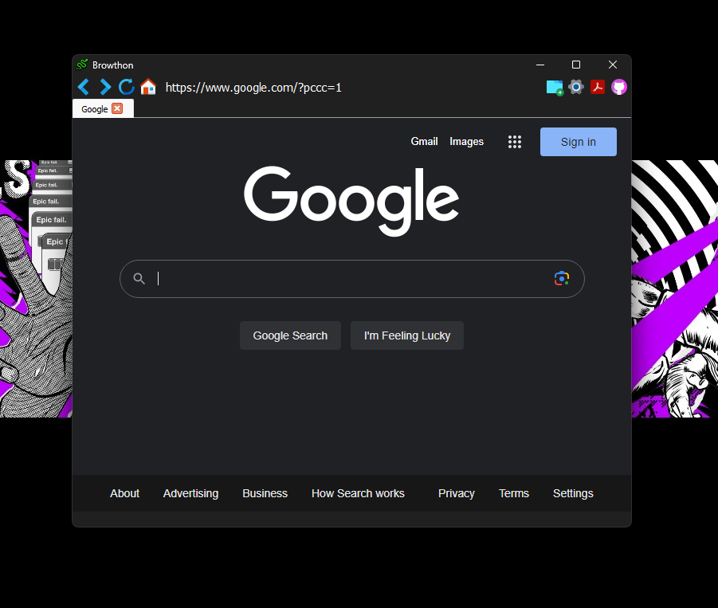
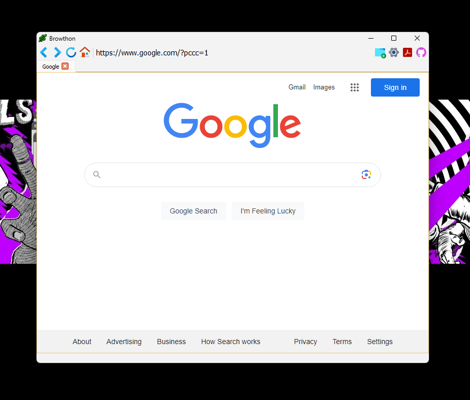

[](http://www.python.org/download/) 
[](https://pypi.org/project/PyQtWebEngine/) 
[](https://en.wikipedia.org/wiki/GNU_General_Public_License) 


# Browthon-project
browthon is a project focused on building a browser with Python language

## Operating Systems Tested
- Windows 11
- Windows 10

## Capabilities
- Create a new tab by clicking the button embedded in the ribbon
- Windows light mode and dark mode support `automatic based on Windows mode`
- Changing the URL of the home page from within the config file `setting.json`
- Turning on and off the proxy and changing its settings from within the config file `setting.json`
- You can change the settings from the file when the program is running and click the reload settings button to load the settings.
- You can get and use PDF output from your entire site `the storage location is your download folder`

## Changes compared to before:
- dark/light mode
- proxy
- new tab QAction (Previously, a new tab was created by double clicking on the tab)
- new icon

## Install
```bash
git clone https://github.com/kinite-gp/Browthon-project.git
cd Browthon-project
pip install -r requirements.txt
python main.py
```


## ScreenShot




### Contact us
- instagram : https://www.instagram.com/kinite_gp/
