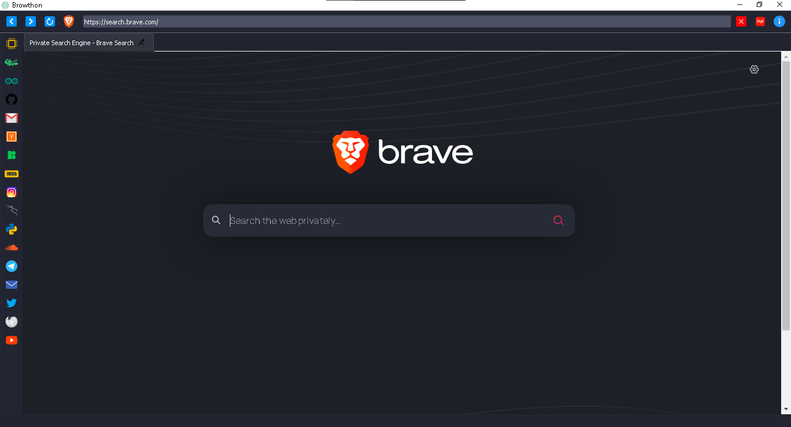

[](http://www.python.org/download/) 
[](https://pypi.org/project/PyQtWebEngine/) 
[](https://en.wikipedia.org/wiki/GNU_General_Public_License) 


# Browthon-project
 browthon is a project focused on building a browser with Python language

## Operating Systems Tested
- Windows 10

- The rest will be tested soon.


## Install
```bash
git clone [link](https://github.com/kinite-gp/Browthon-project.git)
cd Browthon-project
pip3 install -r requirements.txt
python3 browthon.py 
```


## ScreenShot



### Contact us
- instagram : https://www.instagram.com/kinite_gp/
